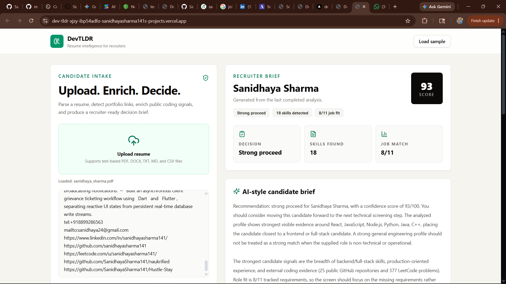
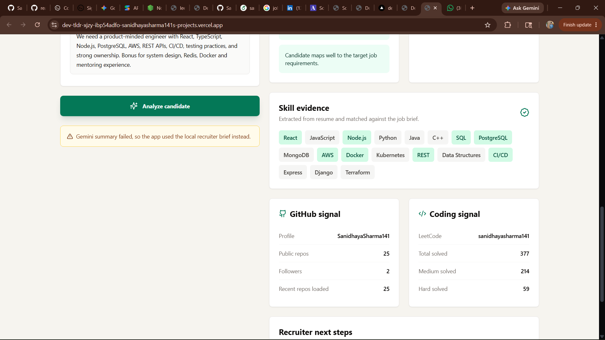

# DevTLDR

DevTLDR is a recruiter-focused resume intelligence dashboard. It helps a recruiter upload a candidate resume, extract useful profile signals, compare the candidate against an optional job description, and generate a clear hiring recommendation.

The goal is simple: make it easier to decide whether a candidate should move forward, needs manual review, or is not a fit for the supplied role.

## Screenshots




## Features

- Upload resumes in PDF, DOCX, TXT, MD, or CSV format.
- Extract visible resume text and embedded PDF/DOCX hyperlinks.
- Detect LinkedIn, GitHub, and LeetCode profile links from the resume.
- Fetch public GitHub profile and repository signals.
- Fetch LeetCode problem-solving metrics when a public handle is available.
- Upload or paste a job description for role-fit analysis.
- Score the candidate only after the recruiter clicks `Analyze candidate`.
- Detect major role mismatches, such as a software resume for a hospitality operations role.
- Generate a recruiter-facing candidate brief with recommendation, risks, strengths, and next steps.
- Optionally use Gemini for richer AI-written recruiter guidance.

## Tech Stack

- React
- Vite
- Tailwind CSS
- Lucide React
- PDF.js via `pdfjs-dist`
- Mammoth for DOCX parsing
- Optional Gemini API integration

## Getting Started

### 1. Clone the repository

```bash
git clone https://github.com/SanidhayaSharma141/DevTLDR.git
cd DevTLDR
```

### 2. Install dependencies

```bash
npm install
```

### 3. Add environment variables

Copy the example env file:

```bash
copy .env.example .env.local
```

On macOS/Linux:

```bash
cp .env.example .env.local
```

Then edit `.env.local`:

```env
VITE_GEMINI_API_KEY=your_gemini_api_key_here
```

Gemini is optional. Without this key, the app still works using the local recruiter brief generator.

### 4. Run locally

```bash
npm run dev
```

Open the local URL shown by Vite, usually:

```text
http://localhost:5173
```

### 5. Build for production

```bash
npm run build
```

### 6. Preview the production build

```bash
npm run preview
```

## How It Works

1. The recruiter uploads or pastes a resume.
2. The app parses resume text and hidden links.
3. GitHub and LeetCode signals are fetched when handles are available.
4. The recruiter optionally uploads or pastes a job description.
5. The app compares candidate evidence against job requirements.
6. The recruiter clicks `Analyze candidate`.
7. The dashboard shows a score, recommendation, risks, strengths, and recruiter guidance.


